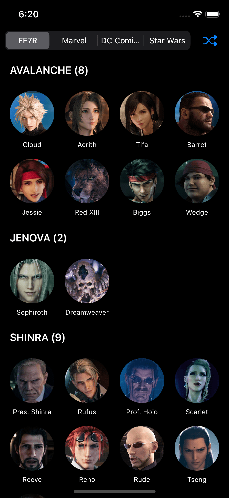
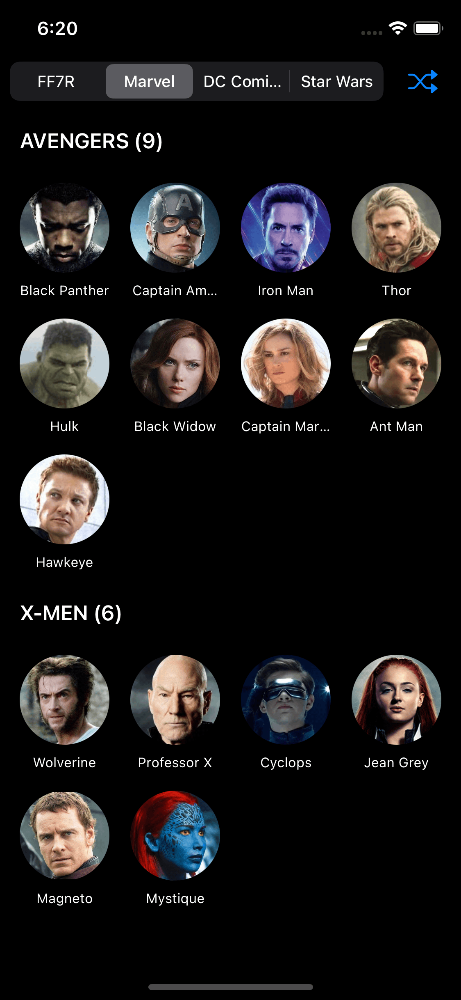
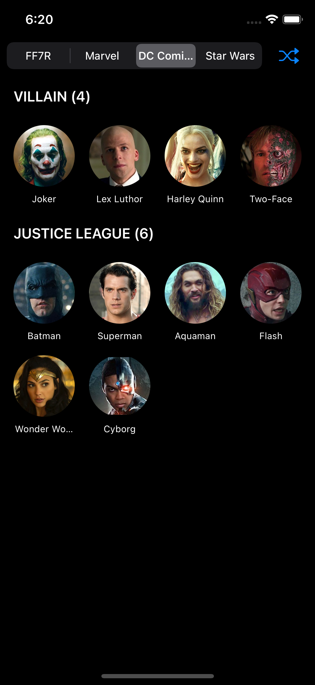
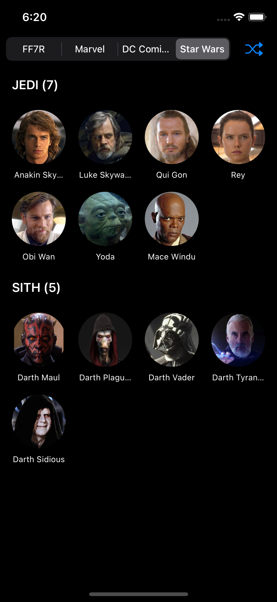

# CharactersGrid

CharactersGrid is based on the tutorial of UICollectionView from Scratch by Alfian, showing the characters from different universes in multiple sections.

## Screenshots

### FF7R Universe

### Marvel Universe

### DC Universe

### Star Wars Universe

